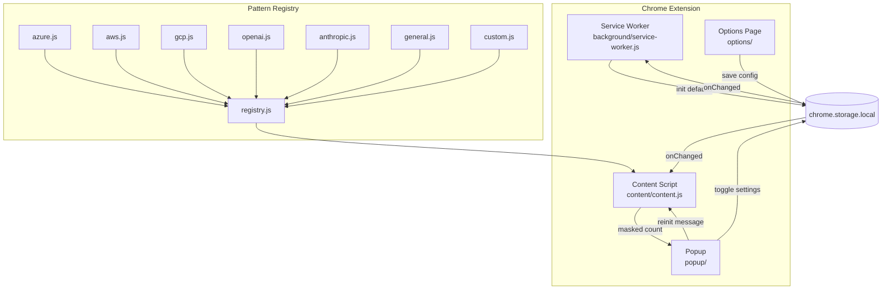
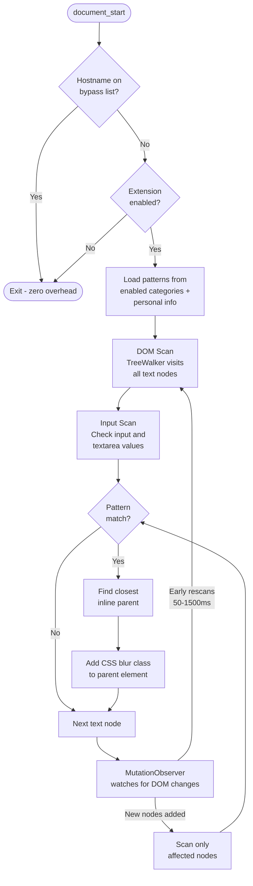
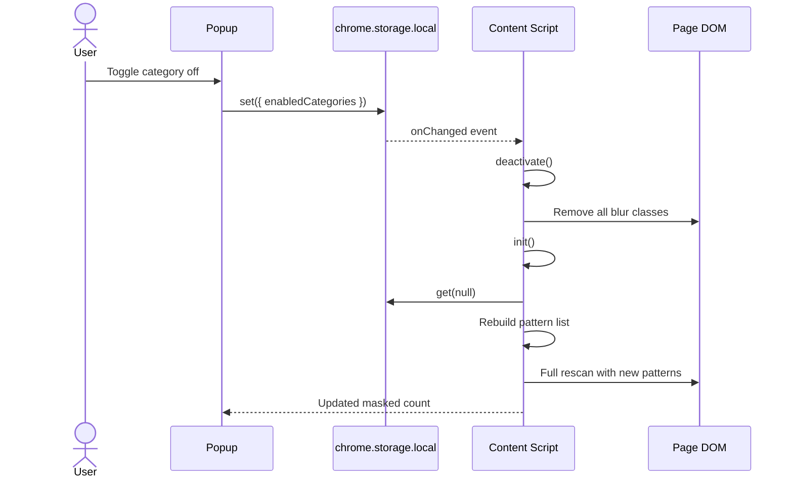

# BlurShield

BlurShield is a Chrome extension that blurs sensitive information on web pages. It was built as a ground-up replacement for [azure-mask](https://github.com/clarkio/azure-mask), which stopped working when Chrome deprecated Manifest V2. Rather than port the old codebase, we wrote a new extension on Manifest V3 and expanded the scope from Azure-only to multi-cloud and general sensitive data.

If you do demos, screen shares, or record your screen while working in cloud consoles, BlurShield keeps credentials, keys, and personal data out of frame.

---

## What it does

BlurShield injects a content script into every page you visit. The script walks the DOM looking for text that matches sensitive patterns (GUIDs, API keys, emails, phone numbers, credit cards, etc.) and applies a CSS blur filter to the parent element. The original content is never modified or removed - the blur is purely visual and reversible.

Masking is active by default on all sites. You control it through the toolbar popup (per-site toggle, category toggles) and a full options page (custom patterns, personal info, bypass list, blur intensity).

### Supported patterns

| Category | What it catches |
| --- | --- |
| Azure | GUIDs, subscription paths, connection keys, storage keys, SAS tokens, resource paths |
| AWS | ARNs, access keys (AKIA/ASIA), account IDs |
| GCP | Service account emails, billing account IDs |
| OpenAI | API keys, organization IDs, webhook signing secrets |
| Anthropic | API keys |
| General | Emails, IPv4 addresses, phone numbers (US, AU, international), street addresses, PO boxes, credit card numbers, masked card displays, API key assignments |
| Custom | Your own keywords and regex patterns added through the options page |

---

## Installation

### From source

```bash
git clone git@github.com:CraigWilsonOZ/BlurShield.git
cd BlurShield
```

1. Open `chrome://extensions`
2. Enable **Developer mode**
3. Click **Load unpacked** and select the project directory

### From zip

Download `blurshield.zip` from the [latest release](https://github.com/CraigWilsonOZ/BlurShield/releases), unzip it, and load the folder as an unpacked extension.

### Install script (Linux)

```bash
./scripts/install.sh
```

Copies files to `~/.local/share/blurshield/` and prints the Chrome loading steps. Set `BLURSHIELD_INSTALL_DIR` to change the location.

### Uninstalling

```bash
./scripts/uninstall.sh
```

Then remove the extension from `chrome://extensions`.

---

## Quick start

1. Install the extension
2. Browse normally - sensitive data is blurred on every page
3. Click the toolbar icon to toggle categories or bypass a site
4. Open **Options** to add personal info, custom patterns, or adjust blur intensity

---

## How it works

### The problem with Manifest V2 extensions

Chrome's Manifest V2 allowed extensions to use background pages with full DOM access and liberal content script injection. Azure-mask was built on that model. When Chrome enforced the migration to Manifest V3, background pages were replaced with service workers (no DOM), and content script behaviour changed. A simple port was not practical.

### Architecture

BlurShield is plain JavaScript with no build step, no npm dependencies, and no bundler.

#### Project structure

```text
BlurShield/
├── manifest.json              Extension manifest (MV3)
├── background/
│   └── service-worker.js      Initialises storage defaults, manages toolbar badge
├── content/
│   ├── content.js             Core masking engine - DOM scanning, pattern matching, blur
│   └── content.css            Blur filter and hover-reveal styles
├── patterns/
│   ├── registry.js            Shared pattern registry API
│   ├── azure.js               Azure - GUIDs, keys, SAS tokens, resource paths
│   ├── aws.js                 AWS - ARNs, access keys, account IDs
│   ├── gcp.js                 GCP - service accounts, billing IDs
│   ├── openai.js              OpenAI - API keys, org IDs, webhook secrets
│   ├── anthropic.js           Anthropic - API keys
│   ├── general.js             Emails, IPs, phones, addresses, credit cards, API keys
│   └── custom.js              User-defined patterns loaded from storage at runtime
├── popup/
│   ├── popup.html             Toolbar popup UI
│   ├── popup.js               Toggle handlers, masked count display
│   └── popup.css              Popup styles
├── options/
│   ├── options.html           Full configuration page
│   ├── options.js             CRUD for patterns, sites, bypass, preferences, import/export
│   └── options.css            Options page styles
├── shared/
│   └── storage.js             Storage wrapper with schema defaults
├── icons/                     Extension icons (16, 48, 128px + SVG source)
└── scripts/
    ├── install.sh             Copy to ~/.local/share/blurshield/
    ├── package.sh             Build blurshield.zip for distribution
    └── uninstall.sh           Remove installed files
```

The `patterns/` directory is the plugin system. Each file registers its patterns with the shared registry at load time. Adding a new provider means creating one file and adding it to the manifest - nothing else needs to change.

The `content/` directory contains the masking engine. `content.css` loads first and defines the blur filter. `content.js` runs the scanning pipeline and manages the `MutationObserver`.

The `popup/` and `options/` directories are standard Chrome extension UI pages. They read and write `chrome.storage.local` and send messages to the content script.

The extension has four components that communicate through `chrome.storage.onChanged` and message passing:



#### Content script pipeline

The content script is the core of the extension. It runs at `document_start` in every frame on every page, which means it loads before the page renders.



The pipeline steps:

1. **Bypass check** - if the hostname (or any ancestor iframe origin) is on the bypass list, exit immediately. Zero overhead on bypassed sites.
2. **Pattern loading** - pull enabled categories from storage and merge with personal info patterns.
3. **DOM scan** - a `TreeWalker` with `SHOW_TEXT` visits every text node, skipping non-visible elements (`script`, `style`, `noscript`, `template`, `iframe`, `canvas`, `svg`) and editable fields.
4. **Input scan** - separately checks `<input>` and `<textarea>` values.
5. **Pattern matching** - each text node is tested against all active regex patterns. The scanner also checks the parent element's full `textContent` to catch sensitive data split across child nodes (e.g., `Visa\n****\n1234`).
6. **Blur application** - the closest inline parent element gets a CSS class that applies `filter: blur()`. Block-level parents are only blurred if their text content is under 200 characters to avoid hiding entire sections.
7. **Mutation observation** - a `MutationObserver` watches for DOM changes and rescans only the affected nodes on the next animation frame.
8. **Early rescans** - follow-up scans at 50ms, 150ms, 300ms, 600ms, and 1500ms catch SPA content that renders after initial load.

#### Why CSS blur instead of DOM manipulation

Earlier masking extensions (including azure-mask) wrapped sensitive text in `<span>` elements or used `splitText()` to isolate matched content. This breaks frameworks like React and Angular that expect the DOM to match their virtual DOM. If the extension modifies the tree, the framework's next render can throw errors or revert the changes.

BlurShield avoids this entirely. It adds a CSS class to an existing parent element. The DOM structure is unchanged - no nodes are added, removed, or split. The blur is applied and removed through class toggling, which frameworks do not track.

#### Pattern registry

Since Manifest V3 content scripts cannot use ES modules, pattern files are loaded in dependency order through the manifest:

```text
registry.js → azure.js → aws.js → gcp.js → openai.js → anthropic.js → general.js → custom.js → content.js
```

Each pattern file calls `BlurShield.registerPatterns()` to add its patterns to a shared registry. By the time `content.js` executes, all built-in and custom patterns are registered. Adding a new provider is a single file plus a manifest entry.

#### Reactive state

All settings live in `chrome.storage.local`. When you flip a toggle in the popup or save a preference in the options page, the storage change event fires in every content script instance. The content script tears down its observer, reloads patterns, and rescans - no page reload required.



### Security

The extension processes page content in-memory and never transmits data externally. Imported settings are validated against an allowlist of keys and types. Custom regex patterns are checked for ReDoS risk (nested quantifiers rejected, length capped at 500 characters). Hostname inputs are validated. Blur intensity is clamped to prevent CSS injection. See [SECURITY.md](SECURITY.md) for the full policy.

---

## Configuration

### Toolbar popup

| Control | Description |
| --- | --- |
| Master toggle | Global on/off for the extension |
| Site toggle | Enable or bypass masking on the current site |
| Category toggles | Enable/disable each pattern category |
| Masked count | Number of items currently blurred on the page |

### Options page

Access via the popup or right-click the extension icon and select **Options**.

- **Personal Info** - email addresses and IPs that are always masked regardless of category toggles
- **Custom Patterns** - keywords (exact match) or regex patterns added through the UI
- **Bypass List** - sites completely excluded from masking
- **Categories** - per-category enable/disable
- **Preferences** - blur intensity (2-20px), reveal on hover
- **Import/Export** - download or upload your full configuration as JSON

---

## Extending BlurShield

### Adding a pattern provider

1. Create a file in `patterns/` (e.g., `patterns/github.js`):

   ```javascript
   BlurShield.registerPatterns([
     {
       id: 'github-pat',
       category: 'github',
       label: 'Personal Access Token',
       regex: /ghp_[A-Za-z0-9]{36}/g
     }
   ]);
   ```

2. Add the file to the `js` array in `manifest.json`, before `content/content.js`

3. Add the new category to the defaults in `shared/storage.js` and `background/service-worker.js`

### Adding custom patterns (no code)

Open the Options page, add a keyword or regex pattern, and it takes effect immediately on all pages.

---

## Permissions

| Permission | Why |
| --- | --- |
| `storage` | Persist settings, patterns, and preferences |
| `activeTab` | Read the current tab URL for the site toggle |
| `scripting` | Required by MV3 for content script injection |
| `webNavigation` | Send messages to all frames when settings change |

The extension does not request `host_permissions`. Content scripts run on all URLs via declarative manifest injection.

---

## Browser compatibility

- **Chrome 88+** (Manifest V3 support)
- **Chromium-based browsers** (Edge, Brave, Opera, Vivaldi) with MV3 support
- **Firefox** is not supported (different MV3 implementation)

---

## Privacy

BlurShield runs entirely in the browser. It does not collect analytics, send telemetry, or make network requests. All configuration is stored locally. See [PRIVACY.md](PRIVACY.md) for the full policy.

---

## Licence

[MIT](LICENSE)
